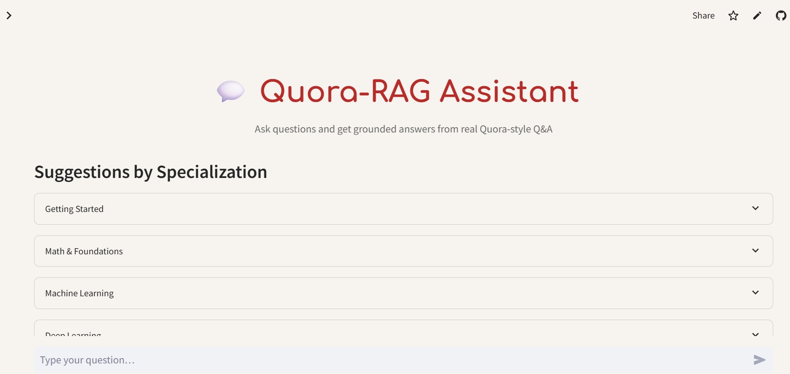

# Quora-RAG: Context-Aware Q&A Assistant

Live app: https://ms-codess-askquorarag-quora-ragapp-4euoh1.streamlit.app/



**Quora-RAG** is a lightweight **Retrieval-Augmented Generation (RAG)** app that answers questions using real Quora-style Q&A data.  
It retrieves relevant pairs from the [toughdata/quora-question-answer-dataset](https://huggingface.co/datasets/toughdata/quora-question-answer-dataset) and generates concise, grounded answers using an LLM.

---

##  Features
-  **Semantic Search** — Uses FAISS vector indexing for fast, meaningful retrieval.
-  **RAG Pipeline** — Combines retrieval + generation for factual answers.
- **Streamlit UI** — Clean interactive web interface.
-  **Optional LLM Layer** — Uses OpenAI (GPT-4o-mini) for concise context-aware output.
-  **Dockerized** — Run anywhere with one command.

---

##  How It Works

```text
User Question → Embedding → FAISS Search → Retrieve Top K Answers → LLM Generates Final Answer
````

**Pipeline Steps:**

1. Dataset loaded from Hugging Face.
2. Each QA pair is embedded using `all-MiniLM-L6-v2`.
3. FAISS builds a vector index for semantic search.
4. Query is embedded → top matches retrieved.
5. Optional LLM (OpenAI API) summarizes retrieved context.

---

##  Tech Stack

| Layer          | Technology                                                                                                                       |
| -------------- | -------------------------------------------------------------------------------------------------------------------------------- |
| Frontend       | Streamlit                                                                                                                        |
| Backend        | Python (FAISS + SentenceTransformers)                                                                                            |
| LLM (optional) | OpenAI GPT-4o-mini                                                                                                               |
| Dataset        | [Hugging Face: toughdata/quora-question-answer-dataset](https://huggingface.co/datasets/toughdata/quora-question-answer-dataset) |
| Container      | Docker                                                                                                                           |

---

## ⚙️ Quick Start

### 🔧 Local

```bash
# Clone repo
git clone https://github.com/ms-codess/quora-rag.git
cd quora-rag

# Create environment
python -m venv .venv && source .venv/bin/activate

# Install dependencies
pip install -r requirements.txt

# (Optional) Add your key
cp .env.example .env
# edit OPENAI_API_KEY=sk-...

# Build FAISS index (first time)
python ingest_index.py

# Launch app
streamlit run app.py
```

---

###  Docker

```bash
docker build -t quora-rag .
docker run -p 8501:8501 quora-rag
```

or with API key:

```bash
docker run -e OPENAI_API_KEY=sk-xxx -p 8501:8501 quora-rag
```

---

### ☁️ Deploy (Streamlit Cloud)

1. Push to GitHub.
2. In Streamlit Cloud → “New App” → choose this repo.
3. Add your `OPENAI_API_KEY` in “Secrets”.
4. Deploy.

-
